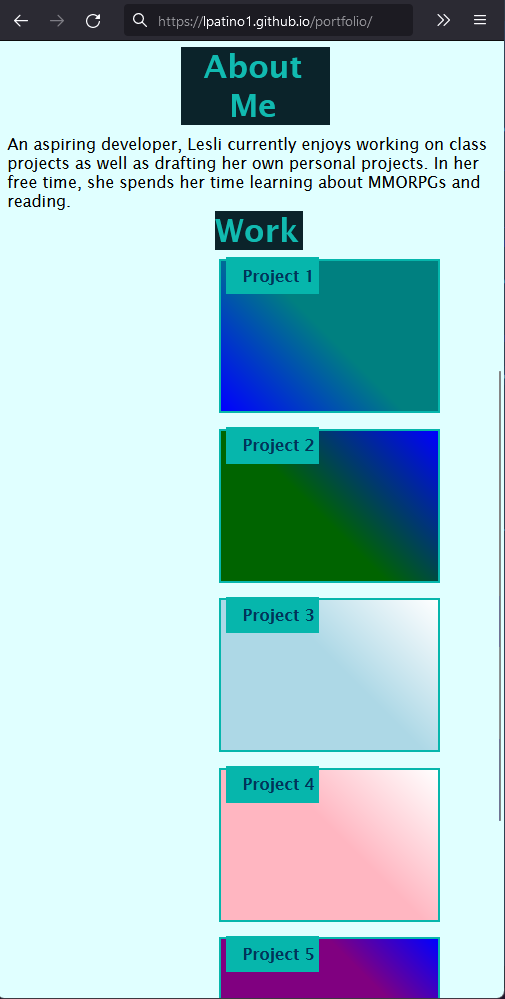

# portfolio

## Description

I created a demo portfolio where a user can display their works. It includes an "About Me", "Contact Me", and "Work" section. It includes a Hero image. Under the "Work" section a user can link up to 5 of their works. In the "Contact Me" section, a user can include their business number, e-mail, GitHub, Twitter and Spotify.

In the navigation bar, there are links to sections on the page such as "About Me", "Work", and "Contact Me". There is an additional link to a user's resume.

The "Work" section project links currently go nowhere because there are no personal projects I have completed to include. A user can replace the "#" to their project's URL.

The header also includes a header where a user can put their name.

There are media queries that adjust to the viewport.

## Installation

No Installation Needed

## Usage

You may run on Visual Studio Code or any other platform.

## Images

Image of Header and Navigation bar in full screen:

Image of Header and Navigation bar in full screen:

Image of Header and Navigation bar in a smaller viewport (max-width: 576px):

## Link to deployed website

https://lpatino1.github.io/portfolio/